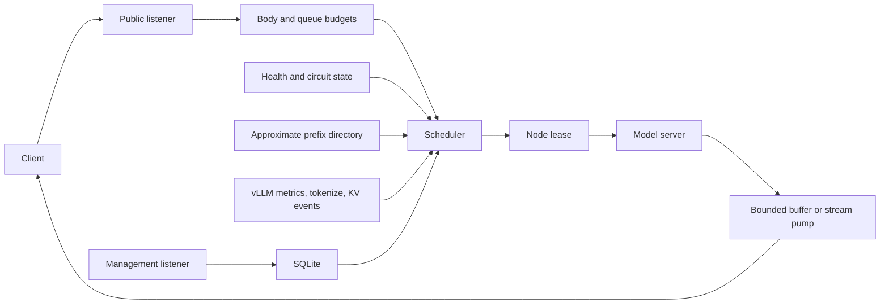

# Architecture

[Documentation index](README.md) | [Configuration and operations](operations.md) |
[Native vLLM provider](vllm.md) | [Deployment](../deploy/README.md)

Estuary has a public inference plane and a private management plane. Both use a
shared scheduler inside each worker process; SQLite is the only persisted node
registry.



## Public Request Flow

The public router exposes local model discovery and an explicit inference
allowlist. A request follows these steps:

1. Assign a request ID and acquire a public-connection permit.
2. Reserve request-count and KiB-rounded body budgets before reading the body.
3. Read the JSON body under idle, total-time, and size limits.
4. Parse the public model and canonical prompt material required for routing.
5. Filter nodes by model mapping, operator drain, health, provider readiness,
   circuit state, retry exclusions, and fresh vLLM waiting depth.
6. Rank eligible nodes by load, recent request signals, and prefix locality.
7. Atomically acquire one node's concurrency permit, waiting without a scheduler
   deadline when all eligible nodes are busy.
8. Rewrite the model, strip client credentials and hop-by-hop headers, inject
   node credentials, and send the upstream request with redirects disabled.
9. Stream through a capacity-one pump or buffer a non-streaming success to EOF.
10. Record successful prefix ownership and release the node permit on EOF,
    failure, timeout, or downstream cancellation.

Requests waiting for node capacity register cancel-safe acquisition futures on
all currently eligible node semaphores. Tokio FIFO semaphore assignment prevents
a new fast-path request from taking capacity already promised to an older waiter.
Independent model pools do not share a global head-of-line lock. Registry,
health, provider, and circuit changes wake waiting selection.

## Scheduling

Node `max_concurrency` is a hard per-process limit. Lower scores are preferred:

```text
observed_load = max(local_active, fresh_vllm_running + fresh_vllm_waiting)
load = ((observed_load + 1) / max_concurrency) / weight

latency = response_header_latency_ewma_ms / target_latency_ms
error = error_ewma + health_penalty

score = load_weight * load
      + latency_weight * latency
      + error_weight * error
```

Missing or stale latency/error observations contribute no penalty. Equal
candidates rotate rather than falling back to a fixed node ID. A fresh vLLM
waiting count at or above `provider.waiting_threshold` removes that node from
admission until telemetry reports recovery.

Prefix preference is disabled when both load-imbalance conditions hold:

```text
max_active - min_active > prefix.balance_abs_threshold
max_active > min_active * prefix.balance_rel_threshold
```

Otherwise, Estuary first prefers the longest authoritative vLLM token match when
available, then the owner of the longest approximate character match. A match
must exceed `prefix.cache_threshold`; health, provider, circuit, and concurrency
gates always take precedence.

## Prefix State

For every endpoint and public model, Estuary keeps a bounded in-memory compressed
radix tree of canonical prompt material assigned successfully by that process.
The key includes prompt-affecting fields such as instructions, messages, tools,
tool choice, response format, parallel tool calls, and reasoning settings.

The directory is bounded by request length, tree count, total characters, and a
per-node character budget. Per-node leaves are evicted by recency. Generic model
servers cannot report real KV eviction, so approximate ownership may contain
false positives or false negatives and is lost on restart.

Native vLLM nodes can add authoritative token-block state from `/tokenize` and
ZMQ KV events. Exact state is also process-local and falls back to approximate
routing whenever telemetry, tokenization, event continuity, or memory authority
is unavailable. See [the vLLM provider guide](vllm.md).

## Protocol Handling

OpenAI-compatible request objects retain unknown fields. Estuary rewrites the
selected model and otherwise forwards supported Chat Completions, Responses,
Completions, and Embeddings requests. OpenAI response bodies and SSE normally
pass through without reconstruction.

Foreground Responses are supported. Stateful Responses features are rejected:

- `background: true`;
- non-null `previous_response_id`;
- non-null `conversation`;
- retrieve, delete, or cancel operations under `/v1/responses/{id}`.

Anthropic Messages selects an upstream protocol per node:

| Setting | Upstream behavior |
| --- | --- |
| `auto` | Native Messages for vLLM; Chat Completions for generic nodes. |
| `native` | `/v1/messages` or `/v1/messages/count_tokens`. |
| `responses` | Convert Messages to OpenAI Responses and convert the result back. |
| `chat` | Convert Messages to Chat Completions and convert the result back. |

Conversion is lazy and node-specific. If a request cannot be represented by a
node's selected protocol, that node is excluded without consuming an upstream
attempt. Anthropic responses use Anthropic error envelopes, model names are
mapped back to public names, and streams receive bounded keep-alive ping events.

The gateway removes only Claude Code's standalone single-line billing marker and
the `clear_thinking_20251015` edit with `keep: all`. Other context-management
edits fail explicitly. User content, tool instructions, environment details,
ordinary system text, and multiline text are preserved.

For detected Codex requests routed to vLLM, namespace tool names are flattened
before forwarding and restored in buffered JSON or SSE responses. Unsupported
vLLM Responses shapes fail explicitly; generic Responses traffic remains on the
normal pass-through path.

## Persistence and Node Lifecycle

SQLite stores a validated node JSON document, optimistic revision, and
timestamps. Migrations run transactionally at startup, WAL mode is enabled, and
triggers advance a database-wide control revision after every node change.
Processes sharing the same local database poll that revision and reconcile their
own runtime scheduler.

Node creation and update probe a complete candidate before mutation. An update
keeps the old node live during validation, then drains it, waits for active
leases, revision-checks the database write, and swaps the runtime node. Delete
uses the same drain-and-wait rule. A timeout leaves the node draining instead of
cancelling accepted inference.

Direct Bearer keys and custom header values are plaintext in the SQLite node
document. Management responses redact their values. The database, WAL,
snapshots, and backups are therefore secrets.

## Health, Circuits, and Retry

Health states are `starting`, `healthy`, `degraded`, and `unhealthy`. Active
probes use node credentials. The first successful startup probe makes a node
healthy; failures degrade it and configured active or passive thresholds make it
unhealthy. Recovery requires the configured consecutive successful probes.
Upstream `429` is treated as load pressure, not an active-health failure.

The circuit breaker is independent of health. Consecutive transport, 5xx, or
body failures open it. After `open_ms`, a bounded number of real inference
requests probe half-open state; the configured success streak closes the circuit
and any half-open failure reopens it.

Retries use a different eligible node and are limited to one through three total
attempts. Connection failures, configured transient statuses, and invalid or
failed non-streaming success bodies can retry before downstream commit.
Streaming responses never switch nodes after successful headers. Any enabled
generation retry is at-least-once and can duplicate work or billing.

## Backpressure and Shutdown

Public connections, admitted requests, admitted request bytes, individual
non-streaming bodies, and aggregate non-streaming buffers all have independent
bounds. Exhaustion waits and applies transport backpressure rather than creating
unbounded tasks or synthesizing a gateway `429`.

A streaming response is moved by a capacity-one channel. Its pump owns the node
permit until EOF, error, client cancellation, upstream idle/total timeout, or
downstream stall timeout. Non-streaming successes are committed only after their
complete body fits within both response budgets.

SIGINT, SIGTERM, and process drain first disable readiness. After the configured
withdrawal delay, the public listener stops accepting while accepted queues and
responses continue. The process exits when they finish or when
`shutdown_grace_ms` expires.

## Supervisor and Rollout

The production supervisor binds the public socket once and passes it directly to
two worker processes. Workers accept from the same kernel queue; inference bytes
do not pass through the supervisor. Each worker has process-local routing state
and shares the local SQLite database.

Rollout drains and replaces slot A, then slot B. The other slot continues to
accept while one is replaced. New workers start paused, initialize their
control-plane state, pass the required readiness gate, and activate the inherited
listener. Management writes are frozen for the transaction. Replacement failure
restores the previous worker, and a slot-B failure also rolls slot A back.

The running supervisor is not replaced by worker rollout. Its stable `current`
link selects the new binary after the next external process restart. A supervisor
crash or container replacement closes the owned listener, so zero-downtime
supervisor replacement requires redundancy outside this process. Operational
commands and persistent paths are documented in [deployment](../deploy/README.md).

## Boundaries

- Public inference has no inbound authentication.
- Concurrency, queues, health, circuits, metrics state, and prefix state are not
  shared across arbitrary gateway replicas.
- Responses state and background operations are not persisted.
- vLLM exact routing excludes remote/offloaded, LoRA, salted, and multimodal KV
  identities that Estuary cannot reproduce from the request.
- Retries do not provide exactly-once upstream execution.
