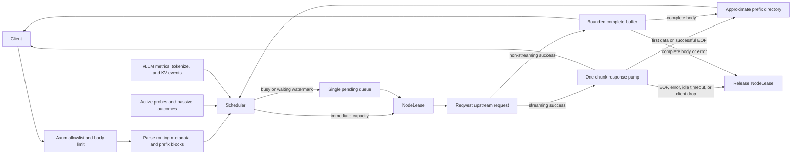

# Architecture

This document describes the current gateway foundation, SQLite-backed control plane, and native vLLM provider. Process policy defaults come from `src/config.rs`; upstream nodes are managed dynamically through the admin API and embedded web application.

## Invariants and scope

- Public inference routes are an allowlist: Chat Completions, foreground Responses create, legacy Completions, Embeddings, Anthropic Messages, and Anthropic token counting. Model list/get are generated locally.
- A node's `max_concurrency` permit covers the upstream request and complete upstream response body. Streaming consumers are isolated by a one-chunk bounded pump and a stall timeout; non-streaming successes use a separately bounded complete buffer.
- Scheduling, permits, queued-body accounting, health, and prefix knowledge are process-local. The supported multi-process topology divides each node budget among fixed gateway slots and replaces one slot at a time.
- Generic-node prefix knowledge is an approximation derived from requests assigned by this gateway. vLLM 0.25+ nodes can additionally supply exact local GPU block events.
- OpenAI fast paths preserve unknown request fields. Native Anthropic requests use Messages and count-tokens routes and preserve unknown fields while applying narrow Claude Code/vLLM compatibility changes: billing-marker removal, no-op context-edit removal, model alias rewriting, and `enable_thinking` template control. Converted Anthropic requests are rebuilt for either OpenAI Responses or Chat Completions.
- OpenAI Responses client SSE/body bytes normally pass through a one-chunk bounded channel unchanged. Detected Codex requests assigned to vLLM are the narrow exception: namespace functions are flattened before the upstream request and restored in buffered JSON or incrementally framed SSE. Native Anthropic SSE is incrementally framed to rewrite the public model. vLLM Native nodes retain generated thinking even when the client requests omitted display so it can round-trip into later agent turns; other native providers and the Responses and Chat adapters keep their protocol-specific display behavior. Every Anthropic streaming mode receives gateway-generated keep-alive pings through the same bounded backpressure path.

## Control plane and persistence

SQLite is the sole persisted node registry. Schema initialization and version checks happen before listeners start; WAL mode and a busy timeout bound writer contention. Each row stores a strictly validated `NodeConfig` JSON document plus an optimistic revision and timestamps. Direct upstream Bearer keys are stored in that JSON as plaintext; management responses redact the value, but the database, WAL, snapshots, and backups remain sensitive. Legacy environment-variable references are still accepted. Additive triggers update a global control revision for every write, including writes from an older process. Each process polls this revision and reconciles changed rows into its local scheduler. The database must live on a protected local filesystem shared by the process slots, never NFS.

Create and update operations build a candidate node and perform its authenticated health check before mutation. vLLM candidates additionally have to pass the fixed 0.25.0 version gate and a metrics scrape. Creation persists the validated row before adding it to the scheduler. Update validates the replacement while the old node remains live, then drains the old node, waits for active leases to reach zero, revision-checks the SQLite update, and swaps the runtime `Arc<Node>`. Deletion follows the same drain-and-wait rule before removing persistence and runtime state. A timeout leaves the existing node draining instead of cancelling inference.

The scheduler stores a snapshot-friendly dynamic node registry. Existing requests retain their node and semaphore permit independently of registry changes. The health loop reads a fresh registry snapshot each interval. A vLLM task reconciler starts and cancels version, metrics, tokenization, and KV subscriber state when node identities are added, replaced, or removed.

## Request flow



The request is read into a bounded `Bytes` value, then parsed as `serde_json::Value` only for routing metadata, model rewriting, prefix extraction, and narrow prompt normalization. A standalone single-line Claude Code `x-anthropic-billing-header:` text block is removed from a top-level system value or an adapter-produced system message before the same parsed value reaches local prefix routing, vLLM tokenization, and upstream serialization. Claude Code's `clear_thinking_20251015` with `keep: all` is removed as a semantic no-op; other context-management edits fail explicitly because vLLM 0.25 cannot apply them. No environment, tool, user, or multiline system content is stripped. Client credentials and hop-by-hop headers are removed. The stored node Bearer key, configured node headers, and legacy environment-backed secrets are injected after client headers, and redirects are disabled.

For Anthropic Messages, the parsed source and original body are retained once. The node's `provider.anthropic_protocol` resolves `auto` to native for vLLM and Chat for generic providers, or selects an explicit `native`, `responses`, or `chat` adapter. Native forwarding reuses the source body; Chat and Responses payloads are otherwise built and cached only after a node requiring that adapter is selected. When the exact-routing gate passes, one Chat-compatible projection may be built earlier for `/tokenize` and then reused if a Chat node is selected. A request-specific conversion failure excludes every node using that protocol without consuming an upstream retry attempt, then returns to the same scheduling class and queue to find a capable protocol.

For OpenAI Responses, Codex is detected from its user agent or client metadata. Adaptation remains node-dependent and occurs only after the scheduler selects a vLLM provider. Namespace tool definitions and namespaced function-call history are flattened with a collision-checked separator; response function calls are restored recursively in complete JSON and per SSE event. Unsupported Responses Lite, custom/tool-search, web-search, and other vLLM-incompatible history shapes fail explicitly instead of being dropped. Generic providers and non-Codex clients retain the normal passthrough behavior.

Before Axum reads an inference body, count and KiB semaphores reserve its ingress budget from `queue_max_requests` and `queue_max_bytes`. Budget exhaustion leaves the HTTP request pending at the middleware boundary, so transport backpressure applies without a `429` and complete prompt bodies cannot accumulate without bound. Missing `Content-Length` reserves the configured maximum body size. The budget is released after the handler has consumed the prompt and established its downstream response.

The scheduler then attempts an immediate node permit. Only a request that cannot acquire any eligible node enters the single queue. A queued request registers a cancel-safe acquisition future in every currently eligible node semaphore and has no scheduler deadline. Tokio's FIFO semaphore assignment prevents a new `try_acquire` fast path from taking a permit promised to an older waiter; the first candidate to become available wins and all losing reservations are dropped. Releasing a node lease wakes that node's semaphore FIFO only; a separate idle notification serves drain waiters. Registry, health, and telemetry changes retain the global eligibility notification, including recovery below the vLLM waiting watermark. Client cancellation drops ingress, queue, and node reservations. This avoids both a per-completion queue broadcast and a global FIFO lock, so a saturated model pool does not head-of-line block an independent pool.

## Scoring and locality gate

Nodes are first filtered by retry exclusion, public-model mapping, and `Node::is_routable()`. For each remaining node, lower scores are better:

```text
observed_load = max(local_active_requests, fresh_vllm_running + fresh_vllm_waiting)
load = ((observed_load + 1) / max_concurrency) / node_weight

latency = 1                                      if no EWMA sample exists
          response_header_latency_ewma_ms
          / target_latency_ms                    otherwise

health_penalty = 0.00 healthy, 0.35 degraded, 0.15 starting

base = load_weight * load
     + latency_weight * latency
     + error_weight * (error_ewma + health_penalty)
```

Starting nodes are present only when `route_while_starting` is enabled. Draining nodes and nodes with an open circuit are excluded; half-open circuits admit only their configured number of real inference probes. A native vLLM node is additionally excluded until `/version` proves it is vLLM 0.25.0 or newer. Fresh `num_requests_waiting >= provider.waiting_threshold` temporarily removes the node from admission, so cache affinity spills to another candidate or waits at the gateway. Metrics failures do not exclude an already verified node; after `telemetry_stale_ms`, both the watermark and upstream load are ignored and scheduling returns to process-local active requests.

For the remaining candidates, the scheduler follows vLLM Router's cache-aware mode switch. It enters load-first mode only when both conditions hold:

```text
max_active - min_active > prefix.balance_abs_threshold
max_active > min_active * prefix.balance_rel_threshold
```

In load-first mode, candidates are ordered by `base`. While load is balanced, a tokenized request first queries the exact KV directory. Remote tokenization is gated by the existing approximate match: Estuary calls `/tokenize` only when `match_ratio > prefix.cache_threshold` and at least one authoritative exact directory contains blocks. Pre-tokenized Completions do not require this remote-call gate.

```text
exact_match_ratio = longest_confirmed_cached_tokens / input_tokens
```

When this ratio exceeds `prefix.cache_threshold`, nodes tied for the longest exact match are preferred. Otherwise the radix tree supplies the owner of the longest approximate prefix and its match ratio:

```text
match_ratio = matched_prefix_chars / input_chars
```

When `match_ratio > prefix.cache_threshold`, healthy matching owners are ordered before other candidates; otherwise all candidates remain in base-score order. Candidates are acquired with non-blocking semaphore operations. Health is checked again after permit acquisition to close the selection race.

The current latency signal ends at upstream response headers. It is useful for gross load differences but is not treated as a completion-time prediction. Requests are not divided into prompt-length classes: a long Agent prompt can have nearly all tokens cached and therefore should not be penalized solely for its raw length. vLLM queue depth and actual cached blocks are the authoritative routing inputs when available.

## Native vLLM state

The vLLM provider has three independent HTTP inputs: `/version` is a compatibility gate fixed at vLLM 0.25.0 or newer, `/metrics` supplies running, waiting, and KV-use gauges, and `/tokenize` renders supported Chat Completions or string Completions exactly as the model server does. Tokenization selects the least-loaded tokenizer, checks its node-local cache, then sends at most one upstream request. That request has one total `provider.request_timeout_ms` deadline; timeout or failure immediately falls back to approximate routing.

KV events arrive as ZMQ multipart messages containing a topic, an eight-byte monotonic sequence, and a MessagePack batch. The decoder accepts the 0.25 replay shape `(seq, payload)` and the 0.26+ shape `(topic, seq, payload)`. A bounded token trie is maintained per Estuary node and vLLM KV group. Block hashes point to trie terminals, parent hashes extend existing paths, removals delete terminals, and `AllBlocksCleared` resets both exact and approximate knowledge for that node. A request's usable match is the minimum match across all learned KV groups.

The subscriber connects to PUB before actively replaying from its next expected sequence, then ignores overlapping queued PUB frames through the replay high-water mark. A disconnect immediately suspends the directory. Only contiguous replay, replay from sequence zero, or `AllBlocksCleared` can establish a trustworthy baseline. Sequence rollback, replay-buffer overflow, invalid MessagePack, conflicting hashes, or the configured memory limit clears the directory; later unanchored incremental events remain non-authoritative. This prefers a cache miss over a false cache hit.

Only local GPU events without LoRA or non-null `extra_keys` currently enter the exact directory. This excludes remote/offloaded, salted, and multimodal-specific cache keys until the routing request carries equivalent identity dimensions. Exact tokenization currently covers Chat Completions, Chat-compatible Anthropic Messages, and single string or pre-tokenized Completions; other request shapes use the approximate tree.

## Approximate radix tree

Prefix material includes the endpoint, public model, prompt/input, and prompt-affecting fields such as instructions, tools, tool choice, response format, parallel tool calls, and reasoning configuration. Parsed JSON gives deterministic object-key ordering; segment separators preserve boundaries.

Each endpoint and public model has a multi-tenant compressed radix tree. Nodes contain canonical Unicode text and the upstream node IDs believed to own that prefix. Lookups return the owners at the deepest matching radix node. `max_request_chars` caps request work, and leaf-LRU eviction keeps each upstream node at or below `max_tree_chars_per_node`. A successful streaming assignment is recorded on the first non-empty upstream body chunk, or on clean EOF for an empty successful body. A non-streaming assignment is recorded only after the complete bounded body reaches EOF, immediately before the response is committed downstream.

This remains best-effort and can briefly contain both false positives and false negatives. Native vLLM reset and eviction events clear the corresponding approximate entries, but generic nodes cannot expose those changes. The size bound approximates vLLM Router's cache pressure, health and load always take precedence, and all prefix state disappears on gateway restart. Canonical prompt text is present in gateway memory.

## Concurrency, streaming, and cancellation

`NodeLease` owns an `OwnedSemaphorePermit` and, in half-open state, a circuit probe ticket. Non-streaming successes are read completely into a bounded buffer before the response is committed downstream. Streaming successes use a detached Tokio pump that owns the lease and upstream body while a capacity-one channel feeds Axum. The pump watches for receiver closure even while the upstream is idle, so a disconnected client cancels the reader and releases the permit. If the client remains connected but stops draining, the channel reservation deadline terminates the pump; already-buffered bytes drain before the downstream observes a body error.

Five independent time bounds are used:

- `connect_timeout_ms`: TCP/TLS establishment;
- `upstream_header_timeout_ms`: completion of the upstream send and arrival of response headers;
- `stream_idle_timeout_ms`: each wait for the next successful response-body chunk;
- `upstream_body_timeout_ms`: absolute lifetime of the complete upstream body;
- `downstream_stall_timeout_ms`: each wait for space in the bounded downstream channel.

The body and stall deadlines release the node permit even if either peer keeps a connection open indefinitely. A streaming timeout after successful response headers cannot be replaced with a fresh OpenAI JSON envelope; the HTTP body terminates with an error instead. On SIGINT, SIGTERM, or process drain, process readiness is disabled first. After `withdrawal_delay_ms`, Axum stops accepting public connections while existing queue entries keep using serving upstream nodes. A response-body guard covers buffered and streaming responses until EOF or downstream cancellation. The process exits after all accepted responses finish, or aborts them only when `shutdown_grace_ms` expires.

## Health and retry state

Node health is `Starting`, `Healthy`, `Degraded`, or `Unhealthy`.

| Event | Effect |
| --- | --- |
| First successful startup probe | Immediately marks the node `Healthy`. |
| First active or passive failure while healthy | Marks it `Degraded`. |
| `unhealthy_threshold` active failures | Marks it `Unhealthy`. |
| `passive_failure_threshold` generation failures | Marks it `Unhealthy`. |
| `healthy_threshold` fresh consecutive successful probes after degradation/failure | Restores `Healthy`. |
| Upstream `429` | Raises the error/load penalty but does not count as a health failure. |

Active probes use node credentials and have deterministic per-node jitter of up to `jitter_percent` of the interval. With the production default `route_while_starting: false`, initial traffic waits for a successful probe.

The circuit breaker is independent of active health. Consecutive transport, 5xx, or body failures open the circuit. When `open_ms` elapses it moves to `HalfOpen`; bounded inference probes close it after `half_open_success_threshold` successes, and any half-open failure reopens it. Draining is a third, operator-controlled gate: it rejects new leases without changing health or cancelling active leases.

Retries require another routable node and are capped to one through three total attempts by validation. The production default is one attempt. Connection failures retry only when reqwest classifies them as connect failures. With retries explicitly enabled, configured transient statuses are retried before their body is exposed. A header timeout returns `504`. A failed or invalid non-streaming success body can retry because no downstream bytes have been committed; a streaming body error, idle timeout, total deadline, or downstream stall terminates the already-started body and is never retried. Any enabled generation retry is at-least-once upstream and may duplicate work or billing even though downstream non-streaming delivery is atomic.

## Current boundaries

- No inbound API-key authentication, tenant quotas, or priorities.
- No global concurrency guarantee across active-active replicas.
- No shared queue, health, or prefix state.
- Node configuration and lifecycle are persisted and reconciled across same-host process slots; process-wide routing and timeout policy changes still require a restart.
- Exact vLLM routing is process-local and deliberately excludes remote/offloaded, LoRA, salted, and multimodal cache keys.
- No Responses background mode, `previous_response_id`, conversation state, or `/responses/{id}` operations. Callers should set `store: false`; an object stored by an upstream is not retrievable through this gateway.
- Native vLLM Anthropic capability follows the installed vLLM 0.25+ version. Estuary maps thinking enablement, but vLLM 0.25 does not expose exact Anthropic thinking budgets through its native request model; the response carries an approximation warning. Responses and Chat conversion cannot represent every Messages feature. vLLM has no Files storage service, and Estuary currently returns an explicit Anthropic error for Claude Code file downloads.
- No exactly-once guarantee for retried generation requests.

## Planned extension seams

### API keys, priority, and fairness

Authentication middleware will resolve a presented key to an internal principal before request metadata reaches admission. Client-supplied tenant or priority headers must be stripped; only trusted identity policy may set `principal_id`, quota class, and priority.

Future API-key priority can add principal-aware fairness without classifying requests by prompt length. Node selection remains late-bound, preserving prefix and observed-load decisions. Metrics must label bounded policy classes, never raw API keys.

### Additional protocols

The Anthropic adapter retains one source request and lazily builds the selected node's declared protocol payload, plus an optional Chat projection when exact tokenization is worthwhile. Responses reasoning continuity is stateless: encrypted reasoning plus its item ID are encoded into the returned Anthropic thinking signature and decoded only when that signature is supplied to a later request. Foreign signatures and adapters that cannot preserve thinking are rejected. The adapter owns Anthropic error mapping, model-name rewriting, usage normalization, named SSE conversion, and keep-alive pings while the scheduler, node lease, health, queue, and metrics remain protocol-independent.

Durable Responses support similarly belongs in a state-affinity adapter backed by a response-ID-to-node store and node generation checks. Additional provider adapters can reuse the current tokenizer, telemetry, and precise-cache extension points without changing the public admission contract.

## References

- [OpenAI OpenAPI, pinned 2026-08-03 revision](https://github.com/openai/openai-openapi/blob/d4fb706e6e05d4cc9f1b33ca59b6e4f3e8edd439/openapi.yaml)
- [OpenAI Chat Completions API](https://platform.openai.com/docs/api-reference/chat/create)
- [OpenAI Responses API](https://platform.openai.com/docs/api-reference/responses/create)
- [vLLM Router cache-aware policy](https://github.com/vllm-project/router/blob/main/src/policies/cache_aware.rs)
- [vLLM Router multi-tenant radix tree](https://github.com/vllm-project/router/blob/main/src/tree.rs)
- [vLLM 0.25 KV event protocol](https://github.com/vllm-project/vllm/blob/v0.25.0/vllm/distributed/kv_events.py)
- [vLLM tokenize protocol](https://github.com/vllm-project/vllm/blob/v0.25.0/vllm/entrypoints/serve/tokenize/protocol.py)
- [llm-d request scheduler](https://github.com/llm-d/llm-d/blob/main/docs/architecture/core/router/epp/scheduling.md)
- [llm-d flow control](https://github.com/llm-d/llm-d/blob/main/docs/architecture/core/router/epp/flow-control.md)
- [llm-d prefix-cache affinity filter](https://github.com/llm-d/llm-d-router/blob/main/pkg/epp/framework/plugins/scheduling/filter/prefixcacheaffinity/README.md)
- [SGLang experimental Rust router](https://github.com/sgl-project/sglang/blob/main/experimental/sgl-router/README.md)
- [Envoy HTTP connection management](https://www.envoyproxy.io/docs/envoy/latest/intro/arch_overview/http/http_connection_management)
- [Envoy upstream circuit breaking](https://www.envoyproxy.io/docs/envoy/latest/intro/arch_overview/upstream/circuit_breaking)
- [Envoy overload manager](https://www.envoyproxy.io/docs/envoy/latest/configuration/operations/overload_manager/overload_manager)
