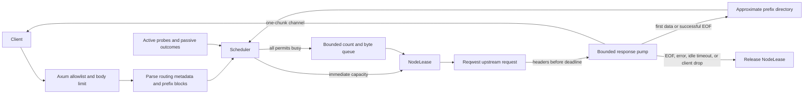

# Architecture

This document describes the phase-one implementation as it exists. Configuration defaults mentioned here come from `src/config.rs`; operators can override them in YAML.

## Invariants and scope

- Public inference routes are an allowlist: Chat Completions, foreground Responses create, legacy Completions, and Embeddings. Model list/get are generated locally.
- A node's `max_concurrency` permit covers the upstream request and complete upstream response body. Slow downstream consumers are isolated by a one-chunk bounded pump and a stall timeout.
- Scheduling, permits, queued-body accounting, health, and prefix knowledge are process-local. The production topology is single-active unless node budgets are explicitly divided between gateway replicas.
- Prefix knowledge is an approximation derived from requests assigned by this gateway, not a claim about the upstream server's current KV cache.
- The gateway preserves unknown request fields. When a model alias must be rewritten, it changes only the top-level `model` field and serializes the JSON again.
- Upstream SSE/body bytes pass through a one-chunk bounded channel with backpressure. The gateway does not parse and reconstruct OpenAI or Responses events.

## Request flow



The request is read into a bounded `Bytes` value, then parsed as `serde_json::Value` only for routing metadata, model rewriting, and prefix extraction. Client credentials and hop-by-hop headers are removed. Node headers and environment-backed secrets are injected after client headers, and redirects are disabled.

The scheduler first attempts an immediate permit. Only a request that cannot acquire any eligible node enters the queue, where one semaphore bounds request count and another accounts for body size in KiB. A queued request registers a cancel-safe acquisition future in every currently eligible node semaphore. Tokio's FIFO semaphore assignment prevents a new `try_acquire` fast path from taking a permit promised to an older waiter; the first candidate to become available wins and all losing reservations are dropped. Health notifications add newly routable candidates without rebuilding existing waits. This avoids a global FIFO lock, so a saturated model pool does not head-of-line block an independent pool.

## Scoring and locality gate

Nodes are first filtered by retry exclusion, public-model mapping, and `Node::is_routable()`. For each remaining node, lower scores are better:

```text
load = ((active_requests + 1) / max_concurrency) / node_weight

latency = 1                                      if no EWMA sample exists
          response_header_latency_ewma_ms
          / target_latency_ms                    otherwise

health_penalty = 0.00 healthy, 0.35 degraded, 0.15 starting

base = load_weight * load
     + latency_weight * latency
     + error_weight * (error_ewma + health_penalty)
```

Starting nodes are present only when `route_while_starting` is enabled. For the remaining candidates, the scheduler follows vLLM Router's cache-aware mode switch. It enters load-first mode only when both conditions hold:

```text
max_active - min_active > prefix.balance_abs_threshold
max_active > min_active * prefix.balance_rel_threshold
```

In load-first mode, candidates are ordered by `base`. While load is balanced, the radix tree supplies the owner of the longest matching prefix and its match ratio:

```text
match_ratio = matched_prefix_chars / input_chars
```

When `match_ratio > prefix.cache_threshold`, healthy matching owners are ordered before other candidates; otherwise all candidates remain in base-score order. Candidates are acquired with non-blocking semaphore operations. Health is checked again after permit acquisition to close the selection race.

The current latency signal ends at upstream response headers. It is useful for gross load differences but is not a token-normalized TTFT or throughput model. Provider queue depth, actual cached blocks, token load, and model-specific prefill/decode rates are future inputs.

## Approximate radix tree

Prefix material includes the endpoint, public model, prompt/input, and prompt-affecting fields such as instructions, tools, tool choice, response format, parallel tool calls, and reasoning configuration. Parsed JSON gives deterministic object-key ordering; segment separators preserve boundaries.

Each endpoint and public model has a multi-tenant compressed radix tree. Nodes contain canonical Unicode text and the upstream node IDs believed to own that prefix. Lookups return the owners at the deepest matching radix node. `max_request_chars` caps request work, and leaf-LRU eviction keeps each upstream node at or below `max_tree_chars_per_node`. A successful assignment is recorded on the first non-empty upstream body chunk, or on clean EOF for an empty successful body.

This remains best-effort and can briefly contain both false positives and false negatives. It cannot observe upstream restart, tokenizer differences, cache capacity, or eviction. The size bound approximates vLLM Router's cache pressure, health and load always take precedence, and all prefix state disappears on gateway restart. Unlike the previous fingerprint directory, canonical prompt text is present in gateway memory.

## Concurrency, streaming, and cancellation

`NodeLease` owns an `OwnedSemaphorePermit`. A detached Tokio pump owns the lease and upstream body while a capacity-one channel feeds Axum. The pump watches for receiver closure even while the upstream is idle, so a disconnected client cancels the reader and releases the permit. If the client remains connected but stops draining, the channel reservation deadline terminates the pump; already-buffered bytes drain before the downstream observes a body error.

Five independent time bounds are used:

- `connect_timeout_ms`: TCP/TLS establishment;
- `upstream_header_timeout_ms`: completion of the upstream send and arrival of response headers;
- `stream_idle_timeout_ms`: each wait for the next successful response-body chunk;
- `upstream_body_timeout_ms`: absolute lifetime of the complete upstream body;
- `downstream_stall_timeout_ms`: each wait for space in the bounded downstream channel.

The body and stall deadlines release the node permit even if either peer keeps a connection open indefinitely. A timeout after response headers cannot be replaced with a fresh OpenAI JSON envelope; the HTTP body terminates with an error instead. On SIGINT/SIGTERM, Axum stops accepting new connections and drains until `shutdown_grace_ms`; remaining server tasks and streams are then aborted.

## Health and retry state

Node health is `Starting`, `Healthy`, `Degraded`, or `Unhealthy`.

| Event | Effect |
| --- | --- |
| First successful startup probe | Immediately marks the node `Healthy`. |
| First active or passive failure while healthy | Marks it `Degraded`. |
| `unhealthy_threshold` active failures | Marks it `Unhealthy`. |
| `passive_failure_threshold` generation failures | Marks it `Unhealthy`. |
| `healthy_threshold` fresh consecutive successful probes after degradation/failure | Restores `Healthy`. |
| Upstream `429` | Raises the error/load penalty but does not count as a health failure. |

Active probes use node credentials and have deterministic per-node jitter of up to `jitter_percent` of the interval. With the production default `route_while_starting: false`, initial traffic waits for a successful probe.

Retries require another routable node and are capped to one through three total attempts by validation. The production default is one attempt. Connection failures retry only when reqwest classifies them as connect failures. With retries explicitly enabled, configured transient statuses are retried before their body is exposed. A header timeout returns `504`; a body error, idle timeout, total deadline, or downstream stall terminates the already-started body and is never retried. Any enabled generation retry is at-least-once and may duplicate upstream work or billing.

## Phase-one boundaries

- No inbound API-key authentication, tenant quotas, or priorities.
- No global concurrency guarantee across active-active replicas.
- No shared queue, health, or prefix state.
- No configuration hot reload or node draining across generations.
- No exact tokenization, KV-cache event stream, GPU metrics, or upstream queue telemetry.
- No Responses background mode, `previous_response_id`, conversation state, or `/responses/{id}` operations. Callers should set `store: false`; an object stored by an upstream is not retrievable through this gateway.
- No Anthropic Messages/Claude Code protocol endpoint.
- No exactly-once guarantee for retried generation requests.

## Planned extension seams

### API keys, priority, and fairness

Authentication middleware will resolve a presented key to an internal principal before request metadata reaches admission. Client-supplied tenant or priority headers must be stripped; only trusted identity policy may set `principal_id`, quota class, and priority.

Admission can evolve from one bounded queue to strict priority bands with starvation controls. Within a band, per-principal weighted fair queuing or deficit round robin should use an estimated token cost instead of raw request count. Node selection remains late-bound at dispatch, preserving prefix and load decisions. Metrics must label bounded policy classes, never raw API keys.

### Claude and additional protocols

An inbound `ProtocolAdapter` should parse protocol-specific metadata and produce a protocol-neutral routing request plus an opaque or translated upstream payload. OpenAI-to-OpenAI remains the zero-copy fast path. A Claude adapter owns Messages request conversion, Anthropic error mapping, and named SSE event translation; the scheduler, node lease, health, queue, and metrics remain protocol-independent.

Durable Responses support similarly belongs in a state-affinity adapter backed by a response-ID-to-node store and node generation checks. Provider adapters can later add tokenizer parity, precise KV events, queue depth, and capability discovery without changing the public admission contract.

## References

- [OpenAI OpenAPI, pinned 2026-08-03 revision](https://github.com/openai/openai-openapi/blob/d4fb706e6e05d4cc9f1b33ca59b6e4f3e8edd439/openapi.yaml)
- [OpenAI Chat Completions API](https://platform.openai.com/docs/api-reference/chat/create)
- [OpenAI Responses API](https://platform.openai.com/docs/api-reference/responses/create)
- [vLLM Router cache-aware policy](https://github.com/vllm-project/router/blob/main/src/policies/cache_aware.rs)
- [vLLM Router multi-tenant radix tree](https://github.com/vllm-project/router/blob/main/src/tree.rs)
- [llm-d request scheduler](https://github.com/llm-d/llm-d/blob/main/docs/architecture/core/router/epp/scheduling.md)
- [llm-d flow control](https://github.com/llm-d/llm-d/blob/main/docs/architecture/core/router/epp/flow-control.md)
- [llm-d prefix-cache affinity filter](https://github.com/llm-d/llm-d-router/blob/main/pkg/epp/framework/plugins/scheduling/filter/prefixcacheaffinity/README.md)
- [SGLang experimental Rust router](https://github.com/sgl-project/sglang/blob/main/experimental/sgl-router/README.md)
- [Envoy HTTP connection management](https://www.envoyproxy.io/docs/envoy/latest/intro/arch_overview/http/http_connection_management)
- [Envoy upstream circuit breaking](https://www.envoyproxy.io/docs/envoy/latest/intro/arch_overview/upstream/circuit_breaking)
- [Envoy overload manager](https://www.envoyproxy.io/docs/envoy/latest/configuration/operations/overload_manager/overload_manager)
