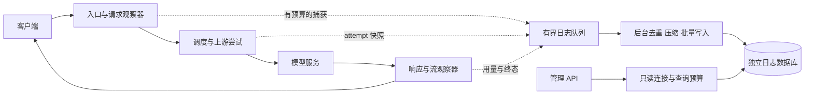

# 会话日志：调研与设计建议

调研日期：2026-10-08。代码基线：`ce4306a`。本文是新增功能的设计提案，尚未实现日志采集、数据库迁移或管理接口。外部工程按调研时官方文档和源码分析；链接到 `main` 的内容会继续变化。

建议第一版使用独立的 `sessions.sqlite3`，把请求与重试的事实记录、会话归组、去重正文分开。保留每次调用的耗时、用量与异常；相同上下文只存一份内容，通过有序引用重建。网关只观察经过它的流量，不能直接还原客户端工具的执行时间、退出码或任务是否完成。

## 1. 类似工程的取舍

| 工程 | 已核对的设计 | 对 Estuary 的启发 |
| --- | --- | --- |
| Langfuse | Session 归组多个 Trace，Observation 表示 LLM、工具等步骤；当前模型把会话等查询维度放在 Observation 行上。 | 请求列表和统计读取小字段；正文详情按需读取。会话、一次用户操作和一次模型调用不要混为一个 ID。[数据模型](https://langfuse.com/docs/observability/data-model) |
| Langfuse 存储 | 分析数据使用 ClickHouse；采集先落对象存储，再排队给后台 worker 批量处理。当前工程区分完整内容和较小的查询投影。 | 借鉴异步写入、元数据与正文分离；其完整基础设施适合大规模部署，第一版不必照搬。[工程说明](https://langfuse.com/resources/engineering/clickhouse-at-agent-scale) |
| Helicone | 显式 Session ID 和层级 Path 归组工作流；应用库、ClickHouse 分析库、对象存储各有职责。日志处理代码批量整理请求、响应和用量，再写各存储。 | 会话 ID 最好由客户端提供；协议正文与分析字段分开。它的公开实现不能作为“已经解决 code agent 上下文去重”的证据。[Sessions](https://docs.helicone.ai/features/sessions)、[架构](https://github.com/Helicone/helicone/blob/main/README.md)、[日志处理源码](https://github.com/Helicone/helicone/blob/main/valhalla/jawn/src/lib/handlers/LoggingHandler.ts) |
| LiteLLM | PostgreSQL `SpendLogs` 记录 request/session、开始结束、首输出时间、模型、用量、费用、状态；有可选正文。生产文档建议批量写入，指出大正文会增大数据库写入压力。 | 请求级小记录足以支撑统计；保存完整 messages 时，需要额外的去重设计。不能只把每次请求的 JSON 压缩后塞进一行。[实际 schema](https://github.com/BerriAI/litellm/blob/main/schema.prisma)、[生产建议](https://docs.litellm.ai/docs/proxy/prod) |
| Phoenix | 关系型结构包含 ProjectSession → Trace → Span，Span 有父子关系、时间、状态、attributes 和 token 字段。支持 SQLite 和 PostgreSQL；官方建议生产多人或高可用场景使用 PostgreSQL。 | 关系型日志库可作为轻量起点；后续集中部署需要有外部存储的演进接口。[数据库 ERD](https://github.com/Arize-ai/phoenix/blob/main/src/phoenix/db/README.md)、[部署架构](https://arize.com/docs/phoenix/self-hosting/deployment) |

这些项目普遍解决了归组、查询和异步采集问题。上述资料没有证明它们默认对逐轮增长的 agent 请求正文做持久化内容去重。下面的内容寻址和序列共享是针对 Estuary 的设计推导。

## 2. 论文与标准能提供什么

| 文献 | 可采用的思想 | 应用边界 |
| --- | --- | --- |
| Dapper，2010 | 通过 trace/span 上下文关联调用，在公共边界埋点，控制采集开销。 | 适合入口、调度、上游、流结束这些边界。详细内容可采样，但低成本请求事实尽量全量保留。[论文](https://research.google.com/archive/papers/dapper-2010-1.pdf) |
| FastCDC，USENIX ATC 2016 | 内容定义分块避免少量插入造成固定分块边界全部偏移，用更低成本寻找重复内容。 | 适合大型且部分变化的工具输出；第一版先按消息/内容块精确去重，实测剩余膨胀后再加入 CDC。[论文](https://www.usenix.org/conference/atc16/technical-sessions/presentation/xia) |
| SGLang / RadixAttention，2023/2024 | 用树组织多轮和分支请求的共享前缀。 | 可以借鉴结构共享思想；它优化的是推理 KV 缓存，不是日志库。正文相同不代表上游 KV 缓存仍然存在。[论文](https://arxiv.org/html/2312.07104v2) |
| AgentSight，2025 | 将 LLM 交互与系统实际行为关联，关注无效循环及协作瓶颈。 | Estuary 只掌握网络一侧；完整工具运行轨迹需要客户端埋点或额外系统采集。不能把模型生成 tool call 当成工具执行成功。[论文](https://arxiv.org/html/2508.02736v1) |
| AgentPProf，2026-09 预印本 | 统一操作记录，离线按任务/阶段归因资源，用分层视图分析长期 agent 成本。 | 预留可版本化的分析标签；任务分段和循环分析放到离线任务，避免在线调用另一个 LLM。研究结果不等于本项目已验证的收益。[论文](https://arxiv.org/html/2609.20301v1) |

OpenTelemetry GenAI 是互操作字段来源，不是论文。调研时约定仍标记 Development，并已迁入独立仓库；新的客户端推理约定区分首 chunk、推理时长、缓存读写 token 和 reasoning token。内部字段保持稳定，导出时通过固定版本映射到 OTel，避免随标准变化反复迁移数据库。[当前约定](https://github.com/open-telemetry/semantic-conventions-genai/blob/main/docs/gen-ai/client-inference.md)

## 3. 当前工程的接入点与缺口

| 位置 | 当前行为 | 设计上的处理 |
| --- | --- | --- |
| `src/store.rs` | `NodeStore` 维护节点配置、revision 和控制状态，连接受 Mutex 保护。 | 日志使用独立文件、连接、迁移和后台写入组件，避免日志查询/清理抢控制面数据库锁。独立文件仍共享主机磁盘资源，必要时单独挂载卷。 |
| `src/server/middleware.rs::assign_request_id` | 接受客户端传入的 `x-request-id`。 | 新增始终由网关生成的内部 `request_pk`，外部 request ID 作为关联字段；重复 ID 不得覆盖历史行。 |
| `observe_request` | 在 `next.run` 返回时记录状态和时长。流式响应此时仍在传输。 | 保留其现有指标语义，另记录完整响应生命周期。不能把当前时长直接命名为端到端完成时间。 |
| `src/proxy.rs` | 已读取有上限的原始请求，解析后进行兼容处理和路由输入生成。 | 客户端输入在兼容修改前捕获；实际上游输入在映射、recipe 转换后捕获。共享 Bytes 也要计入独立日志内存预算。 |
| `src/proxy/upstream.rs` | 实施选择、模型映射、adapter 和重试。 | 一次入站请求对应多个 attempt；记录实际发起网络请求的尝试，协议不适配的候选淘汰另作为 route event。 |
| `src/proxy/response.rs` | 缓冲响应已经存在上游正文、转换后正文和 usage 读取位置。 | 在转换两侧观察；日志副本不得让响应缓冲预算提前释放后仍无预算地保留大对象。 |
| `src/proxy/streaming.rs::BodyGuard` | 已观察首输出、usage、完成/失败及取消，但主要用于节点状态和聚合指标。 | 扩展为明确的终态原因，分别记录上游生成结束与下游 body 结束。日志收集不改变流的字节、poll 节奏和超时策略。 |
| `src/inference_stats.rs` | 有限大小观察器记录 input/cached/output token，首输出包括文字、reasoning、工具增量。 | 复用观察边界，增加 usage 来源、完整性和更多细分字段；现在的首输出不能直接当成用户可见文本 TTFT。 |
| `src/scheduler.rs::Selection` | 对外只有总 score、前缀匹配等，部分评分输入只在 Candidate 内。 | 形成不可变 RouteDecision 快照，不在日志线程重新读取变化后的节点状态，也不为日志重新运行调度。 |
| supervisor 与退出流程 | 滚动升级时新旧 worker 可以同时存在。 | 处理重叠写库、旧进程未结束请求和迁移兼容；不能假设永远只有一个写日志进程。 |

## 4. 会话、请求与尝试的身份

采用四层关联：Session（长会话）→ 可选 Turn/Trace（一次用户任务）→ Request（一次入站 HTTP 调用）→ Attempt（一次上游调用）。第一版不单建 Turn 表，保留 `trace_id`、`turn_id`、`parent_span_id` 等可空字段。

1. 首选显式的 `X-Estuary-Session-Id`。允许接入配置明确列出的客户端 metadata/header 字段，保留 `session_source` 和客户端原 ID。不假定当前 Codex 或 Claude Code 一定发送某个固定字段。
2. 显式会话 ID 在网关认可的 `scope_id` 内唯一。当前可把一个部署当作一个 scope；未来多租户由认证层分配 scope，不能信任请求头中的 tenant 声明。
3. 没有显式 ID 时，默认请求暂不归组。可以另外提供可关闭的推断：在同一 scope/客户端关联范围内，寻找包含前一响应或高比例历史内容的精确上下文延续，要求唯一候选，限制时间窗口。
4. 系统提示词、tools schema、IP、User-Agent、公共模型名不能单独决定会话归属。多个 agent 可以共享这些内容；上下文压缩又可能让真实会话失去共同前缀。
5. 推断只写可修正的关联，保存证据与算法版本；歧义时维持未归组。内容去重不依赖成功识别会话。
6. 客户端的父请求 ID 与网关内部父请求关系分开，记录 `parent_source=explicit|inferred`。顺序按接收时间加内部 ID 展示，不声称并发请求具有唯一真实序号。

`/v1/messages/count_tokens`、embeddings 和推理调用用 `operation_kind` 区分。辅助请求可以属于会话，但不自动增加用户回合数或推理调用数。当前网关拒绝 stateful Responses；不能通过日志功能偷偷加入 `previous_response_id` 状态恢复能力。

## 5. 去重：保留调用事实，共享内容

### 5.1 为什么整包 hash 与压缩不够

第 n 次 agent 请求通常携带前 n 次上下文。若每轮新增 B 字节，系统与工具定义为 S，n 轮逐次全量记录的输入量约为：

`n × S + B × n × (n + 1) / 2`

理想内容共享的正文量接近 `S + n × B`，另加请求行、序列节点、索引和压缩开销。例如 S=64 KiB、B=4 KiB、n=100：全量输入约 26 MiB，唯一内容约 464 KiB。这个约 57 倍差异只是合成数学例子，不是实际 workload 的空间或速度保证。

整体请求每轮都会变化，整包 hash 很少命中；独立压缩每一行无法共享前面行中的大段历史。即使正文共享，每次网络调用的 token、费用和异常也必须各自保存。

### 5.2 内容原子与规范化

- 第一级按完整 message/item、system/instructions、tools definition 等结构提取；第二级将其中的大文本/内容块拆成独立 blob，避免不同 role、call ID 或 envelope 使相同正文重复落库。
- 同一 scope 内，以稳定编码的内容、内容类型、规范化版本和脱敏策略版本生成 SHA-256 或 BLAKE3 标识。选一种固定算法并保存版本；哈希冲突时校验长度/内容或隔离冲突，不能悄悄替换。
- JSON 对象键顺序可稳定化；数组顺序、数字和值类型必须保留。数字解析不能先转成有精度损失的浮点值再宣称无损；超出支持范围时保留原始片段并标记。字符串内部不排序、不删空白、不改换行；字符串形式的 function arguments、reasoning、签名和 opaque/encrypted 字段必须原样保留。
- 第一版不强求 OpenAI Responses、Chat Completions、Anthropic Messages 之间的完整结构等价。无损保留各协议结构，精确相同的文本叶子仍可共享。展示层统一角色和工具块，存储层保留原协议。
- 日志专用脱敏先发生，再计算持久化 hash。脱敏规则更新改变 namespace/version；不能把随机占位符导致的低命中误认为内容变化，也不能把脱敏后相同的两份正文当作原始请求完全相同。
- 不使用 embedding/模糊文本相似度删除内容。相似工具结果中的一个退出码、文件路径或字符可能决定 bug；语义相似度只适合离线标签。

### 5.3 有序序列共享

为历史消息构建不可变、内容寻址的序列节点：

`node_hash = H(scope, schema_version, previous_node_hash, item_hash)`

节点保存 `previous_node_hash`、`item_hash` 和长度；payload 只保存序列尾节点及 envelope 引用。A=[m1,m2]、B=[m1,m2,m3] 共用 A 的节点；分叉 C=[m1,m2,m4] 也共用前缀。消息和叶子是共享图，序列节点形成共享前缀结构。

这让新增落库量随新增内容增长，而不是每轮重写整串引用。计算或核验传来的全量请求仍要读取其字节，不能声称在线 CPU 也变成 O(新增量)。使用有上限的近期哈希缓存降低重复数据库查找，缓存淘汰不影响正确性。

只实现 blob 去重、仍逐请求保存完整 hash 数组的简化方案也可以先用，但数组引用量仍可能随轮数平方增长。对于用户明确提出的 agent 重复问题，建议第一版就实现序列节点，先不加入通用 CDC。

### 5.4 分支、压缩、响应与大内容

- 上下文压缩或中间历史修改后，为新序列创建根/尾，已有相同叶子继续共享；不覆盖旧请求，不用必须依赖上一条 request 的 JSON diff 链。
- 响应正文被下一轮输入再次携带时，叶子 blob 可直接复用；响应记录仍保留其来源 request 和时间。
- SSE 默认聚合成文本、reasoning、tool call 等输出块，记录 usage 与稀疏异常事件；不按每个 token/chunk 生成数据库行。可选调试采样保留原始 SSE。
- 超大且部分变化的文件/工具结果，后续可加入 FastCDC + chunk hash + 压缩。CDC 放在 bounded 后台预处理，不逐 token 写库。
- 图片/base64 和其他大附件使用可配置捕获预算；超过预算记录类型、原始字节数和 capture 状态。默认不为日志下载远程图片或 URL 内容。
- 输出累积超过日志预算后继续转发和统计，不把截断内容标成完整输出。顺序、partial JSON、tool call ID、签名和末尾使用量必须有明确的回放/缺失规则。

完整性分为 `semantic_complete`（可还原捕获到的协议 JSON 值/输出块）、`wire_complete`（可还原精确 JSON/SSE 字节）、`partial` 和 `metadata_only`。规范化 JSON 不保证原始空白、键顺序和 SSE 分块完全一致；脱敏内容也不能用于原始字节复现。

## 6. 建议表结构

以下是逻辑字段草案，实施时再写带 CHECK/FK 的完整迁移。SQLite 时间为 UTC Unix ms 的 INTEGER；耗时为单调时钟计算的微秒 INTEGER；token/字节数为非负 INTEGER；hash 可存 32-byte BLOB，UUID 可选 TEXT。所有不可观测值用 NULL，不用 0 替代未知。

### `sessions`：会话归组与可重建摘要

| 字段 | 用途 |
| --- | --- |
| `scope_id, session_pk` | 复合主键；内部会话 ID。 |
| `external_session_id, session_source` | 外部 ID 与 `explicit_header|explicit_metadata|inferred` 来源；显式 ID 在 scope 内设唯一约束，推断不占用同一唯一命名空间。 |
| `client_kind, client_version, user_ref, project_ref` | 可选、受长度限制的来源维度；区分客户端自报与认证层确认。 |
| `first_seen_at_ms, last_seen_at_ms` | 会话时间范围。 |
| `request_count, inference_count, error_count, known_input_tokens, known_output_tokens` | 派生摘要，可由 requests 重建；重复 flush 不得重复累加。 |
| `association_version, association_metadata_json` | 推断版本及有限的关联说明；不要塞全历史或凭据。 |

### `requests`：每次入站调用的事实

| 字段组 | 字段与含义 |
| --- | --- |
| 身份 | `scope_id, request_pk` 主键；`external_request_id, session_pk?, trace_id?, span_id?, parent_span_id?, turn_id?, parent_request_pk?, parent_source?`。 |
| 进程与版本 | `instance_id, boot_id, gateway_version, config_revision, routing_config_hash`；revision 不是脱敏配置快照本身。 |
| 协议与请求 | `operation_kind, method, client_endpoint, client_protocol, client_kind?, requested_model?, streaming, generation_parameters_json`；path 使用受控 endpoint，参数白名单且有上限。 |
| 时间 | `accepted_at_ms, ended_at_ms?, ingress_wait_us?, body_read_us?, tokenization_us?, scheduler_wait_us?, headers_ready_us?, first_output_us?, first_visible_text_us?, upstream_done_us?, downstream_body_done_us?, total_us?`。request 时间从网关接受请求开始，不包含客户端工具思考和网络前半程。 |
| 结果 | `lifecycle_state, http_status?, outcome, finish_reason?, terminal_marker_seen?, response_complete, delivery_state, attempt_count, selected_attempt_no?`；HTTP 状态与语义结果分别保存。 |
| usage | `input_tokens?, output_tokens?, cache_read_tokens?, cache_write_tokens?, reasoning_tokens?, usage_source, usage_complete, usage_raw_blob_hash?`；保留 provider 原始值及归一化规则版本。 |
| 数据量 | `request_bytes_received, upstream_response_bytes_received, downstream_bytes_yielded, unique_content_bytes?, content_reused_bytes?`；原始量和规范化内容去重量分开，禁止拿不同单位直接算压缩率。 |
| 内容 | `client_input_payload_id?, client_output_payload_id?, capture_state, capture_reason?, observation_complete, redaction_version, sampling_policy, expires_at_ms`。内容过期后保留元数据和 `expired` 状态，清空可回放引用；观察器跳过超大/不支持事件时，也不能声称完整测得首输出和 usage。 |
| 异常 | `error_phase?, error_class?, provider_error_code?, error_fingerprint?, error_message_preview?`；摘要先脱敏、限制长度。 |

`lifecycle_state=started|finalized|interrupted`；终态 `outcome=success|error|cancelled|unknown`。`delivery_state=body_consumed|body_dropped|unknown` 表示服务端观察到的 body 生命周期，不能证明客户端应用完整处理了响应。

请求行上的模型用量采用选定响应的归一化 usage。若要统计上游总消耗，则聚合 attempts 已知用量并展示未知尝试数量，不能只统计最后一次成功或把未知按零收费。

### `attempts`：上游重试与调度诊断

| 字段组 | 字段与含义 |
| --- | --- |
| 身份与选路 | `scope_id, request_pk, attempt_no` 主键；`node_id, node_instance_id, node_revision, provider, upstream_endpoint, upstream_model, response_model?, adapter, adapter_version`。 |
| 关联 | `upstream_request_id?, upstream_response_id?`；两个 ID 语义不同。 |
| 时间与状态 | `started_at_ms, ended_at_ms?, scheduler_wait_us, header_latency_us?, first_chunk_us?, first_output_us?, last_output_us?, body_duration_us?, downstream_blocked_us?, http_status?, outcome, retry_reason?, error_phase?, error_class?`。 |
| 调度快照 | `route_score, score_components_json, predicted_prefill_tokens?, predicted_decode_tokens?, prefix_match_chars, prefix_match_tokens, prefix_match_source, node_active, node_capacity, upstream_running?, upstream_waiting?, kv_utilization?, telemetry_age_ms?, cache_authority_state`。 |
| 内容与用量 | `upstream_input_payload_id?, upstream_output_payload_id?`；与请求相同的 nullable usage 字段、`usage_source, usage_complete, upstream_usage_raw_blob_hash?`。转换前后相同内容共享 blob，不各复制一整包。 |

用于高频筛选的字段单列；score components、脱敏的静态配置说明等低频字段用有限 JSON。详细候选排名仅对错误、异常慢请求或采样请求记录，限制候选数。不能每次保存全部节点状态和完整节点配置。

### `payloads`、`content_blobs`、`sequence_nodes`：可回放内容

| 表 | 字段 |
| --- | --- |
| `payloads` | `scope_id, payload_id, schema_version, protocol, envelope_blob_hash?, sequence_roots_json, representation, logical_bytes, capture_state, created_at_ms`。roots 含 JSON path 与序列尾 hash；envelope 保留除被提取部分外的字段和占位标识，编码约定保证可逆。 |
| `content_blobs` | `scope_id, blob_hash, content_kind, encoding_version, redaction_version, hash_algorithm, codec, raw_bytes, stored_bytes, data BLOB, created_at_ms`。主键覆盖 scope 与 hash namespace。结构化 item 的子引用采用带类型的 manifest 编码，避免误把用户字符串当内部引用。 |
| `sequence_nodes` | `scope_id, node_hash, schema_version, previous_node_hash?, item_blob_hash, item_count, logical_bytes, created_at_ms`。不可变节点；复合外键限制同一 scope。 |

压缩发生在规范化/哈希之后。保存 node 时验证前驱已存在、长度严格递增，限制序列深度/回放大小；不允许客户端直接提交任意内部 hash 作为可信对象引用。

### `request_events`：稀疏状态与异常

`scope_id, request_pk, event_seq` 为主键；`attempt_no?, observed_at_ms, elapsed_us, event_kind, severity, payload_blob_hash?, details_json`。

事件包括协议转换警告、候选协议不适配、输出截断、SSE 解析异常、明确的上游结束标记、客户端断开、超时等。首输出和基础性能指标直接写请求/attempt 字段，不必重复生成事件行。每请求事件数和 details 字节数都有上限，剩余数量计数。

工具调用可从输出记录 `tool_call_id/name/arguments_ref`，后续请求里出现 tool result 时再记录对应内容。字段名称明确为 `tool_call_observed`、`tool_result_observed`；没有客户端报告时，工具执行耗时和成功状态维持未知。

第一版共七张核心表。后续可增加 `analysis_annotations`（分析算法版本、标签、置信度、依据）和按小时聚合表；不让离线分析修改历史事实。必要的调度参数/节点脱敏快照可以按 hash 存 blob，禁止跨库 FK 或把配置凭据带入日志。

### 索引与查询

- requests：`(scope_id, accepted_at_ms DESC, request_pk DESC)`；`(scope_id, session_pk, accepted_at_ms, request_pk)`；错误记录的 partial index。外部 request ID 用非唯一索引。
- attempts：主键已经覆盖 request 查询；需要按节点分析时加 `(scope_id, node_id, started_at_ms)`。
- sessions：`(scope_id, last_seen_at_ms DESC, session_pk)`；所有关联/内容访问均检查 scope。
- 列表必须限制时间区间和页大小，采用 `(timestamp, internal_id)` 游标。默认只读取 metadata；正文和原始 SSE 通过详情接口读取。
- 第一版以 session/request/node 时间查询为主，按实测再加入 model 索引、FTS 或聚合表；不把所有 JSON 字段都建索引。

## 7. 性能与异常的语义

### 性能字段

1. **入口耗时**：ingress 等待、接收请求体、解析/兼容处理、tokenization、scheduler 等待分别计时。阶段可能包含其他阶段，提供明确起止点，不能无条件相加。
2. **上游与用户等待**：发送上游到 headers、首 chunk、首有效输出、首用户可见文本、最后输出、上游 EOF 分开。空 SSE、role 事件和 keepalive 不算有效输出；reasoning/tool arguments 算有效输出但不算可见文本。
3. **下游影响**：累计等待下游容量的时间、body 被消费或丢弃、发给 HTTP 层的字节数。当前 pump 有背压，上游观测时间可能混入下游阻塞；不能当作模型内部纯 decode 时间。
4. **吞吐**：有可靠输出 token 且 n>1 时，可给出 `(last_output - first_output)/(n-1)` 的粗略 TPOT；chunk 不等于 token，输出 token 可能包含隐藏 reasoning，必须保留估计标识和测量来源。提供上游原生指标时单独显示。
5. **用量与缓存**：保留 input/output、缓存读写、reasoning、原始 usage；缺 usage 不记 0。不同 provider 的 input 是否包含缓存 token 需要专用归一化规则，不能统一相加，也不能重复累计 SSE 的累计 usage。
6. **路由质量**：预测 prefill/decode 与实测输出、score 构成、KV 前缀来源/权威性、节点负载、遥测新鲜度。节点级 metrics scrape 只代表快照，不能宣称某请求的 GPU 利用率、prefill 用时或真实缓存命中。
7. **日志开销**：队列数量/字节、capture 内存、正文去重比例、压缩比例、批次耗时、commit lag、WAL 大小、查询耗时、丢弃/截断数量。不可用日志功能自己的表作为唯一健康信号，相关指标输出到现有 metrics。

### 异常字段

采用 `error_phase` + 低基数 `error_class` + 脱敏摘要，不只保存 error 字符串或 HTTP code。

| 阶段 | 建议类别 |
| --- | --- |
| ingress/body | 排队/接收超时、body 过大、非法 JSON、缺 model、客户端在上传时断开。 |
| routing | 无模型、无健康节点、等待超时、候选协议不可表达、tokenization 失败/跳过与降级原因。 |
| upstream | connect/DNS/TLS/transport、响应头超时、429、5xx、provider 错误码、重试原因和次数。只有 transport 实际提供的信息才能细分，不推测 DNS/TLS 时长。 |
| adapter | 输入不可转换、recipe/协议选择、输出结构无效、流事件解析失败、兼容改写和 thinking budget 近似警告。 |
| stream/body | body idle/total timeout、SSE event 过大、已知协议缺结束标记、上游截断、下游 stall、客户端取消、worker 强制退出。 |
| capture/storage | 超预算、采样省略、正文截断、解析不支持、database busy/disk full、写入失败、schema 不兼容、退出未刷完。 |

HTTP 200 后出现错误或提前 EOF 仍是异常；已知协议完整成功需要相应终止证据。无法识别的透传协议记 `completion=unknown`，不修改其字节或强行判定失败。客户端取消通常单独统计，不算上游故障。

agent 层可离线分析：相同 tool+arguments 重复出现、相同错误结果持续重试、上下文增长但输出无进展、缓存读 token 异常低、同一任务大量协议回退。结果是带规则版本的“疑似循环/异常”标签；正常重复测试、轮询和客户端重试不能被直接删除或拒绝。

## 8. 写入架构与故障隔离

- AppState 只持有轻量 `LogSink`。RequestObservation 传入 proxy、scheduler、adapter、BodyGuard；核心调度器不依赖 rusqlite。建议模块 `session_log/{model,capture,content,writer,store,query,retention}`，分别负责协议观察、存储和清理。
- 捕获预算同时限制队列条数、排队字节、活跃 response accumulator 总内存、单请求 input/output 与稀疏事件大小。只限制 channel 容量会被几条大上下文请求耗尽内存。
- 请求路径复用已有解析结果，记录时间/计数与有限内容片段；规范化、hash、压缩和同步 SQLite 操作放到专用后台线程。不得每个请求无限 spawn blocking 任务。
- metadata 和正文分开排队/限额，给开始/终态小记录保留容量。队列饱和先舍正文/调试事件；metadata 也无法接收时明确计数丢失，不能宣称绝对无损。
- 给已接受记录保留终态入队预算，finalize 使用一次性状态转换；上游结束与下游 drop 更新各自字段，避免双重计数。每次更新带单调 observation revision，优先级队列或重放导致 started 晚到时不能覆盖 finalized。Drop 只做非阻塞通知，不执行 async 写库。
- 每个 worker 一个 writer；同一主机滚动升级时新旧 writer 的短事务由 SQLite 串行，配置有限 busy timeout、有限重试和内存回退。不得抢一个永久锁让旧进程仍服务的请求无法记录。多机集中部署使用外部日志服务，不把 WAL 文件放共享网络盘。
- 批次由条数、字节或短时间窗口触发，批次大小有上限；内容和引用在一个事务内写入，保证 committed root 没有悬空引用。若正文事务失败，可独立落 metadata，并设置 `capture_reason=storage_error`，不带无效 payload 引用。
- 日志库读连接与 writer 分开，启用 WAL；长查询限制时长并及时关闭读事务，监控 checkpoint 与 WAL 增长。WAL 支持并发读和一个写事务，不提供多 writer 并行提交。[SQLite WAL 文档](https://sqlite.org/wal.html)
- 默认对可观测日志使用 fail-open：存储失败不影响推理。对离线导出等重放，内部 ID/事件序号作幂等键，finalize revision 保证旧状态不会覆盖新状态。
- 启动记录写入 `boot_id`，重启后将已确认退出 boot 的残留 started 行标记 interrupted，原结束时间未知；滚动升级中存活的旧 boot 不能被新 worker 误标记为崩溃。
- 数据库的 schema migration 采用新增兼容字段/表，明确最低读写版本；滚动升级前检查兼容范围，不在旧 worker 活跃时破坏性迁移。
- 停机先停止接收、等待 response drain，再在总退出期限内 flush 日志、结束 writer；超时报告待写数量。不能无限延长现有退出期限。

建议起始参数：metadata 队列 4096 条、正文全局内存 64 MiB、每请求 input/output 捕获各 2 MiB、每请求最多 32 条事件、100 条/1 MiB/100 ms 触发写批次。数值仅作压测起点，最终以真实 agent 上下文大小、并发和磁盘性能调整；完整会话部署需调大捕获预算并配合磁盘配额。

“异步且不阻塞请求”和“进程断电零丢失”无法仅靠内存队列同时保证。第一版明确为 best-effort 可观测日志：SQLite 已提交记录的耐久性由 synchronous 模式决定，未入库事件可能在崩溃时丢失。若需要强审计，再增加 durable spool/collector ACK；严格保证必须在适当边界等待持久化确认，并承担延迟。disk full 时也不能同时保证请求继续与日志绝不丢失。

## 9. 留存、删除和管理界面

- 内容策略建议支持 `metadata` 与 `deduplicated_content`；raw wire 是单独调试开关。开发/内网使用可显式选择正文模式，不自动把日志当作长期完整会话备份。
- metadata 与正文可配置不同 TTL，例如元数据 30 天、正文 7 天；这些是建议值。优先使用时间/磁盘配额清理，保留统计的覆盖区间和丢失数量。
- 不能按 blob 创建时间直接删正文：较新的请求可能仍引用很旧的系统提示词。清理从仍保留正文的 payload roots 出发，追踪 sequence nodes 与 item/leaf manifests 做可达性 GC。
- 清理时保护写入中的 batch/roots；使用一致的 GC epoch/事务协调和有上限的增量任务，避免 GC 删掉刚提交的内容。只有过期引用断开后的不可达 blob/node 才可回收。
- 第一版不跨 scope 去重；需要“一个会话删除全部正文”的强边界时可改成每会话 namespace，牺牲跨会话系统提示词共享。共享内容若仍被其他保留会话引用，其物理对象必须继续存在，界面应说明删除语义。
- 只读备份使用 SQLite 一致性备份 API，不能只复制主文件漏掉 WAL。批量清理不等于立即缩小文件，checkpoint、回收空间和必要 vacuum 在维护预算内进行。
- 正文、错误体与 spool 应使用同一脱敏策略；headers 只保存 allowlist，Authorization、Cookie、上游 key、环境凭据不落库。已知大 opaque 字段独立限制访问与留存。
- 会话页显示时间线、分支和本轮新增内容，允许展开本次实际完整输入；列表只显示摘要、协议、模型、耗时、用量和结果，正文按需加载。
- 请求详情并排显示客户端协议与上游协议、adapter、输入/输出差异和每次 attempt。对于之前的 Codex/DeepSeek 串协议问题，这些字段能直接说明响应转换走了哪个分支。
- 指标页可按 node/model/client 聚合；session、request ID、hash、用户正文不能进入 Prometheus label。错误类别等低基数维度可以进入 metrics。
- 管理读取接口复用现有 admin 授权，增加正文访问配置、查询/解压字节上限与游标分页；不向公开模型 API 暴露日志或内部 hash 检索能力。

## 10. 实施顺序与验收

**阶段一：独立记录链路。** 新配置和迁移、LogSink、请求内部 ID、attempt、准确终态与计时、usage 来源、有限错误事件。配置类型/默认值沿用现有 Rust → 生成前端契约，避免新增重复维护。先验证数据库不可用不影响请求。

**阶段二：正文去重与回放。** 协议捕获 adapters、内容 blob、序列节点、payload envelope、部分输出规则、retention/GC。第一版上线会话功能前完成这一阶段，否则仅有“日志库”仍会遇到 agent 重复正文膨胀。

**阶段三：管理页面。** 请求列表、会话时间线、完整输入展开、客户端/上游差异、attempts、性能分解、日志健康与内容缺失说明。显式会话归组优先；推断归组另作为实验开关。

**阶段四：按证据演进。** 真实上下文仍有大量近似重复再做 CDC；需要多实例集中查询或大量分析时导出到外部 collector + PostgreSQL/ClickHouse，并将正文移到对象存储。数据库选择以 commit lag、磁盘增长、查询 p95 和写入竞争为依据，不设未经压测的固定 RPS 门槛。

验收至少覆盖：

1. 同一外部 request ID 的两次调用保留两行；网关重试写一个 request、多条 attempt；日志重放不重复统计。
2. Codex Responses、Claude Messages、Chat Completions、DeepSeek recipe 的输入和输出记录协议正确；未知字段、tool arguments、签名和 opaque 内容不被损坏。
3. 100/1000 轮追加上下文、分支、上下文压缩、工具 ID 改变、重复响应回传：回放正确，唯一内容与序列节点随新增内容增长。统计实际去重率和 CPU 成本，不只检查相同 hash 命中。
4. SSE 任意分块、空/keepalive、reasoning、工具参数、累计 usage、缺 usage、200 后错误、缺结束标记、客户端取消、慢下游：结果状态与耗时可解释；原有转发字节/背压行为不变。
5. 队列满、正文预算满、写库锁、disk full、强制退出、重启、退出 flush 超时：推理行为稳定，缺失可见，内存有上限。
6. TTL 删除旧 request 后，仍保留的新 request 能回放共享前缀；GC 与并发写入不产生悬空引用；跨 scope 查询拒绝访问。
7. 新旧 worker 重叠与迁移：没有冲突覆盖、错误标记 interrupted 或无限等待；日志耐久性符合选定模式。
8. 与关闭日志的基准比较：网关额外 p50/p95/p99、TTFT、吞吐、CPU、RSS、write lag、存储增长。压测应包括真实长上下文 fixture；任何“低于某百分比开销”的目标必须经过验证再写成承诺。

在这些条件满足前，不应把日志库称为完整审计系统、可靠原始字节备份或 code agent 全链路工具追踪。
